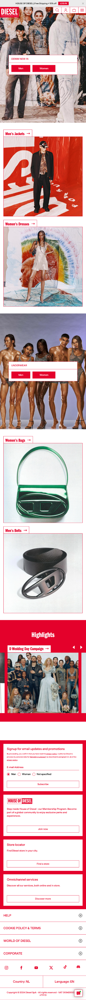
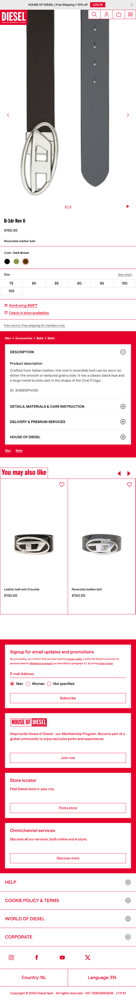
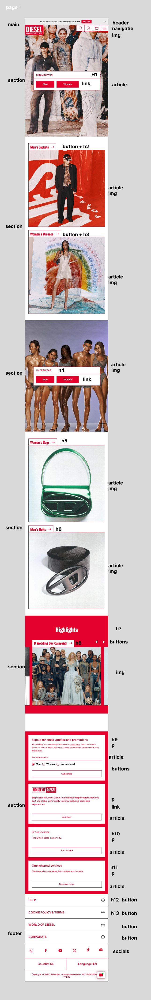
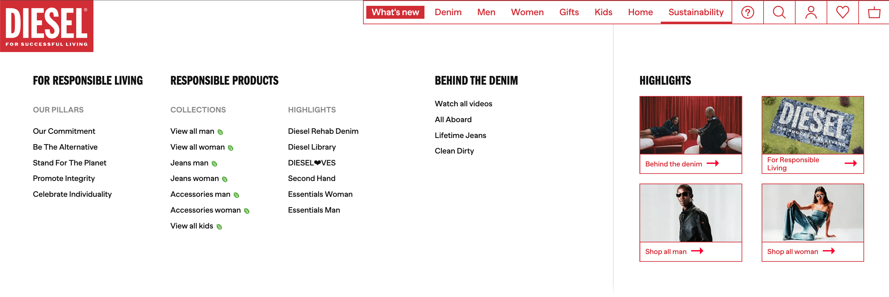
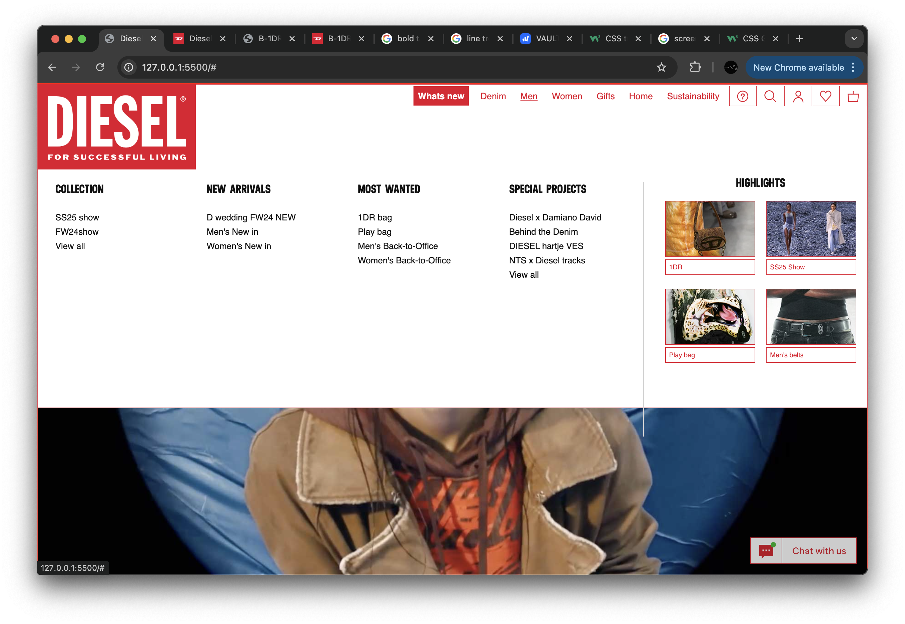
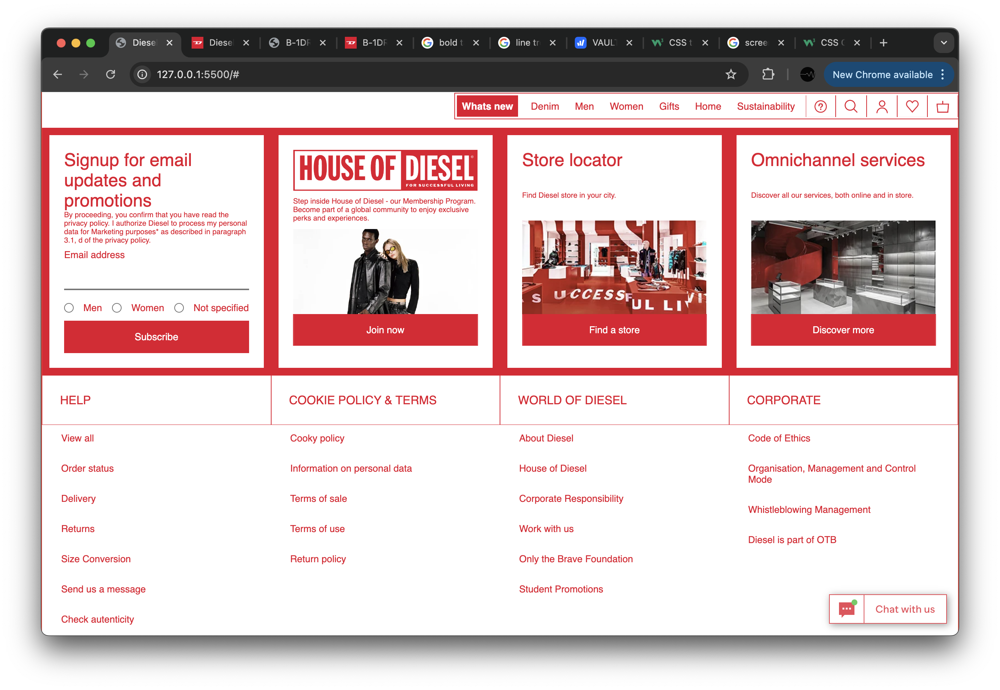
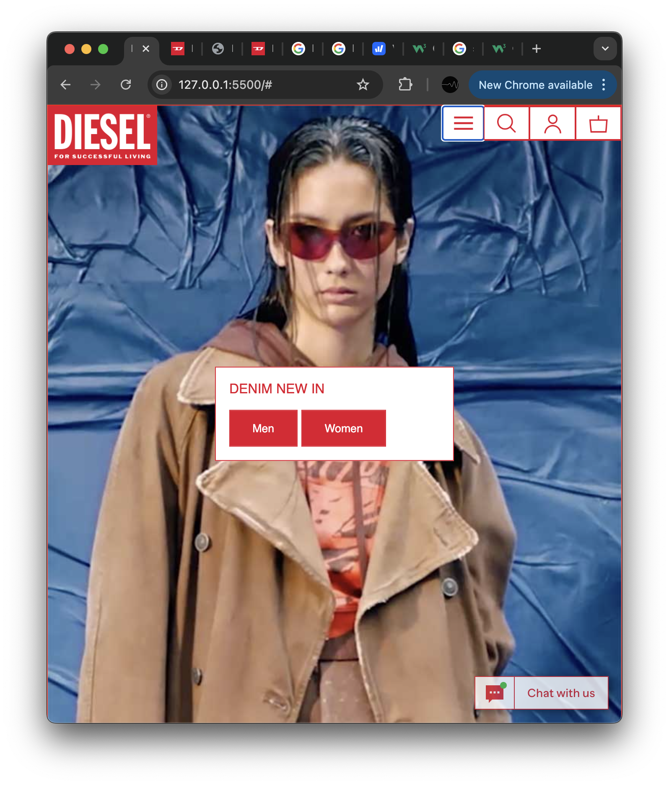
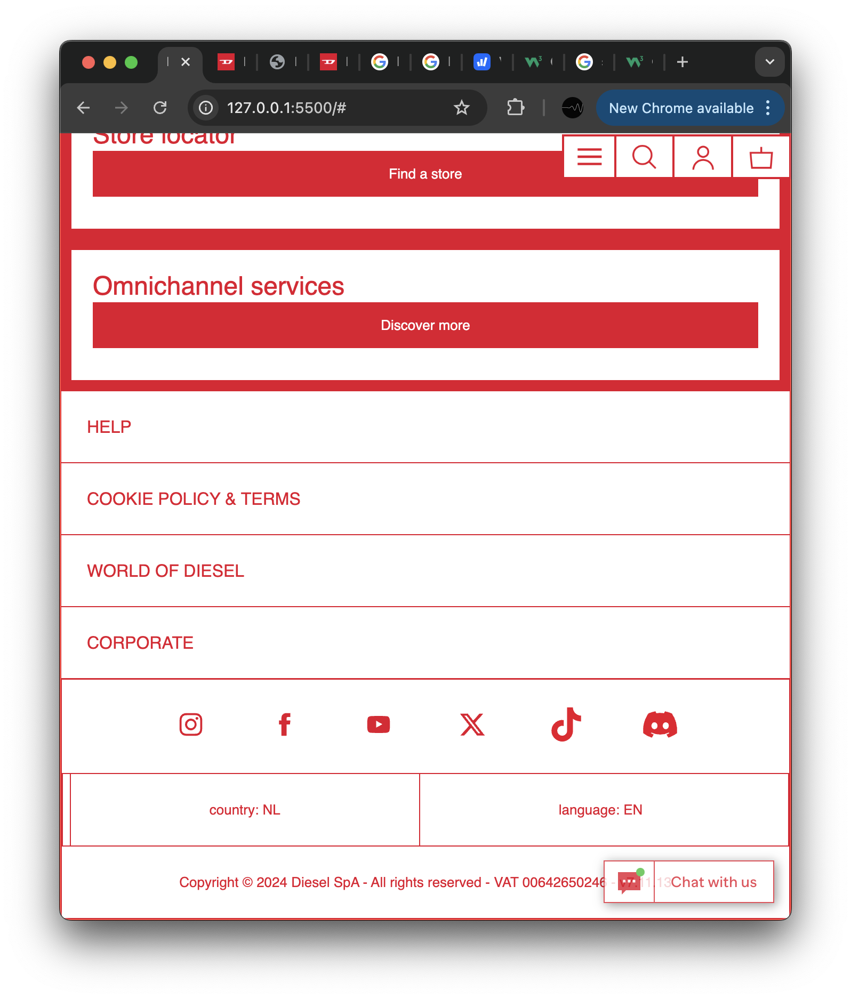
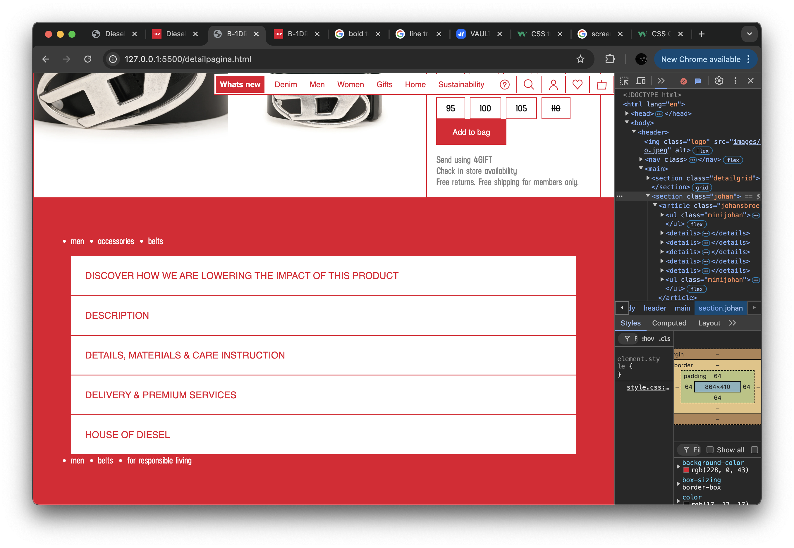

# Procesverslag
Markdown is een simpele manier om HTML te schrijven.  
Markdown cheat cheet: [Hulp bij het schrijven van Markdown](https://github.com/adam-p/markdown-here/wiki/Markdown-Cheatsheet).

Nb. De standaardstructuur en de spartaanse opmaak van de README.md zijn helemaal prima. Het gaat om de inhoud van je procesverslag. Besteedt de tijd voor pracht en praal aan je website.

Nb. Door *open* toe te voegen aan een *details* element kun je deze standaard open zetten. Fijn om dat steeds voor de relevante stuk(ken) te doen.

## Jij

  
uitwerken voor kick-off werkgroep

  ### Auteur:
  Catharina Christian

  #### Je startniveau:
  Blauw (rood)

  #### Je focus:
  responsive
 

## Je website

  
uitwerken voor kick-off werkgroep

  ### Je opdracht:
  link naar de website die je gaat namaken óf de naam/omschrijving van je eigen ontwerp
  https://nl.diesel.com/en/

  #### Screenshot(s) van de eerste pagina (small screen): 
  main page / home page van diesel site
  

die diesel site vind het erg leuk om elke twee dagen een ander plaatje hier en daar te zetten dus mn site is momenteel niet identiek aan hun laatste versie 

  #### Screenshot(s) van de tweede pagina (small screen):
  detailpagina standaart zwarte dieselbelt
  
 

## Toegankelijkheidstest 1/2 (week 1)

  
uitwerken na test in 2e werkgroep

  ### Bevindingen
  Lijst met je bevindingen die in de test naar voren kwamen:

  -header moet je doorheen skippen, hij geeft wel aan wat je kan verwachten in de navigatie
  -eigenlijk alle knoppen zijn links, dat geeft hij wel duidelijk aan
  -in carousel van highlights kom je pas na 4 of 5x uit dat deel van de main
  -geen beschrijvingen plaatjes, wat misschien wel handig zou zijn bij een webshop

## Breakdownschets (week 1)

  
uitwerken na afloop 3e werkgroep

  ### de hele pagina: 
  

   

  ### dynamisch deel (bijv menu): 
  

## Voortgang 1 (week 2)

  
uitwerken voor 1e voortgang

  ### Stand van zaken
  fonts inladen, WOFF? luky niet
  kan ik zomaar h3 gebruiken aan het begin
  carousel met pijltjes maken? 
  responsive met media queries?

  ### Verslag van meeting

  -hoe laad ik een font goed in: @ fontface
  -in een webshop verschillende items articles maken
  -de <detail> gebruiken --> summary
  -headings nummeren kunnen door elkaar lopen
  -CSS nog veel stappen maken
  -(achtergrond)kleuren en lettertypes in custom properties zetten
  -boxsizing aanzetten
  -gebruik maken van overflow in begin van carousel

## Voortgang 2 (week 3)

  
uitwerken voor 2e voortgang

  ik was er niet bij deze feedback maar de vragen die ik had in eerste instantie heb ik wel de les daarna beantwoord gekregen

  ### Stand van zaken
Hoe maak ik een mega menu van de dropdown die ik nu heb op een hover

Article h1 gaat niet met z index onder uitklappende menu

Highlight h2 boven de article

Info deel van 4x grid naar 1 zonder tussenstappen
+ plaatjes?

Footer vormgeven?

Die twee verschillende footers maken en dan gewoon volledig uitklappen zonder javascript 

Mega menu div in list van nav zitten?

  ### Verslag van meeting
Div maken die op display hidden voor meganav
article van h1 z index zoeken anders background image naar picture tag
media query!

## Toegankelijkheidstest 2/2 (week 4)

  
uitwerken na test in 9e werkgroep

  ### Bevindingen
  van navigatie springt hij naar het tweede artikel
  carousel doet hij wel
  mijn plaatjes hebben wel een alt text die hij registreert
  in footer gaat hij alles af
  navigatie gaat moeilijk maar dat kan ook liggen aan dat de links niet echt ergens heen gaan

## Voortgang 3 (week 4)

  
uitwerken voor 3e voortgang

  ### Stand van zaken
  hier dit ging goed & dit was lastig (neem ook screenshots op van delen van je website en code)

  ### Verslag van meeting
  hier na afloop snel de uitkomsten van de meeting vastleggen

  - punt 1
  - punt 2
  - nog een punt
  - ...

## Eindgesprek (week 5)

  
uitwerken voor eindgesprek

  ### Je uitkomst - karakteristiek screenshots:
  

  ### Dit ging goed/Heb ik geleerd: 
Knop animatie op de buttons, met behulp van clip-paths en zo keyframes gelukt. best wel cool
media querys heb ik op gegeven moment wel door gekregen
fonts inladen en grid waren nieuwe kennis.
chrome inspector is erg nuttig
svgs inladen

  

  
    

  ### Dit was lastig/Is niet gelukt:

vooral veel bij de detail pagina, komt ook omdat ik daar veel later mee ben begonnen.

mysterieuze witruimte waar ik niet vanaf ben gekomen op de voorkant..

w3c validator geeft error door de div met mega nav en container nav in ul, echter loopt alles in de soep als ik die onderaan zet... hier over gehad dat dit raar is maar ik kan er niks meer aan doen.
Div wat dus z-index van 1000 heeft uit zichzelf ?? met javascript opgelost —> if menu open dan die hele container display none.

Verder articles aan het einde (.info) die lijken elementen te verliezen als ik ze schaal naar telefoon size. Niet gelukt om om te lossen

Wat ik mis: De volledige uitwerking van mega navigatie. 

sticky element had ik meer tijd aan willen besteden

last minute realisatie dat twee <li> bij het rode blok verkeerde kant staan

  
    
  

## Bronnenlijst

  
continu bijhouden terwijl je werkt

  Nb. Wees specifiek ('css-tricks' als bron is bijv. niet specifiek genoeg). 
  Nb. ChatGpT en andere AI horen er ook bij.
  Nb. Vermeld de bronnen ook in je code.

  1. opdracht hamburger menu dlo
  2. quinten kok over buttons stijlenm
  3. https://www.w3schools.com/css/css3_fonts.asp
  4. https://www.w3schools.com/howto/howto_css_mega_menu.asp 
  5. https://www.w3schools.com/css/css_background_image.asp 
  6. https://www.cssportal.com/css-clip-path-generator/
  7. https://www.w3schools.com/css/css_form.asp 
  8. chatgpt: advies bij het positioneren en scrollgedrag van een sticky element in combinatie met grid layout, echter niet gelukt.
  9. chatgpt: gedrag mega nav werkte niet met de grid die ik het gaf, code ingeladen en toen laten zien dat er styling van andere section op werkte.
  10. dropshadow:https://developer.mozilla.org/en-US/docs/Web/CSS/box-shadow
  11. https://css-tricks.com/snippets/css/a-guide-to-flexbox/ 
  12. https://css-tricks.com/snippets/css/complete-guide-grid/
  13. https://www.w3schools.com/tags/tag_details.asp
  14. https://developer.mozilla.org/en-US/docs/Web/JavaScript/Reference/Statements/if...else
  15. 

